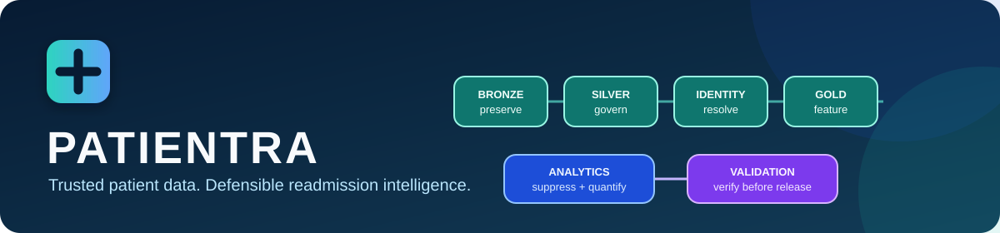
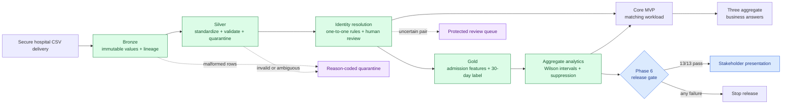

<p align="center">
  
</p>

<h1 align="center">PATIENTRA</h1>

<p align="center">
  <strong>Clean Data Before Smart Care.</strong><br>
  <em>One Patient. One Care.</em>
</p>

<p align="center">
  <strong>Privacy-conscious patient identity resolution and readmission analytics, built on a fully auditable Bronze-to-Gold data pipeline.</strong>
</p>

<p align="center">
  <a href="https://github.com/DevDataMLOps/Patientra/actions/workflows/ci.yml"></a>
  
  
  
  
</p>

<p align="center">
  <a href="docs/solution-storyline.md"><strong>Solution Storyline</strong></a> ·
  <a href="docs/demo.md">5-minute demo</a> ·
  <a href="docs/architecture.md">architecture</a> ·
  <a href="docs/evidence/README.md">verified evidence</a> ·
  <a href="docs/presentation/PATIENTRA_Phase6_Validation_Presentation_Final.pptx">presentation</a> ·
  <a href="SECURITY.md">security</a>
</p>

## RESULTS

These are the three business questions the Core MVP calculates from the governed
pipeline: identity-matching impact, the highest released diagnosis-group rate, and
identity-resolution workload.

<table>
  <tr>
    <td align="center"><strong>17.90%</strong><br>Before identity matching</td>
    <td align="center"><strong>19.42%</strong><br>After identity matching</td>
    <td align="center"><strong>43</strong><br>Hidden readmissions recovered</td>
    <td align="center"><strong>I50 · 32.13%</strong><br>Highest-readmission diagnosis</td>
  </tr>
</table>

<p align="center"><strong>304 automatic / 8 human-review matches</strong></p>

<p align="center"><a href="docs/evidence/judge-results/README.md">See the aggregate-only derivation and interpretation boundary</a></p>

## Executive overview

PATIENTRA turns fragmented hospital CSV deliveries into trustworthy, disclosure-controlled
readmission intelligence for the fictional **Lakeside Health Network** case study. The
project preserves every source delivery, standardizes only with explicit rules, resolves
cross-hospital identity conservatively, constructs leakage-controlled 30-day labels, and
publishes aggregate analytics only after an independent release gate passes.

This repository demonstrates a production-minded data engineering pattern—not a clinical
prediction system. The starter data is synthetic, but all identifiers and linked records
are handled as if they were protected health information.

| Challenge | PATIENTRA control | Verified proof |
|---|---|---|
| Inconsistent hospital extracts | Immutable Bronze lineage and reason-coded quarantine | Source hashes and row reconciliation |
| Ambiguous dates and coded values | Explicit operator-supplied date order and codebooks | Ambiguous values are quarantined, never guessed |
| Duplicate identities across hospitals | Conservative one-to-one matching with human review | 304 automatic pairs and 8 reviewed cases |
| Label leakage and incomplete follow-up | Admission-time features plus explicit observation cutoff | 2,938 Gold admissions reconciled |
| Small-cell disclosure risk | Primary and complementary suppression | 8 of 51 breakdown rows suppressed |
| Release drift or tampering | Independent hash, schema, count, privacy, and version checks | 13/13 release checks passed |

## Verified release snapshot

All figures below come from the checked-in, aggregate-only evidence chain.

| Measure | Verified result |
|---|---:|
| Source records ingested | 2,304 patients · 3,056 admissions · 11,330 labs |
| Silver records retained | 2,304 patients · 2,938 admissions · 10,231 labs |
| Cross-hospital master patients | 1,996 |
| Gold admission rows | 2,938 |
| Eligible admissions for analytics | 2,827 |
| 30-day readmissions | 549 |
| Overall admission-level rate | 19.42% (Wilson 95% CI: 18.00%–20.92%) |
| Suppressed aggregate rows | 8 of 51 |
| Automated tests | 34 passed |
| Independent release checks | 13 of 13 passed |
| Identifier hits in analytics outputs | 0 |

> **Interpretation boundary:** results are descriptive associations from a synthetic
> hackathon dataset. They are not causal findings, clinical recommendations, or a
> validated patient-risk model.

## End-to-end architecture



### Design principles

- **Fail closed:** schema drift, ambiguous formats, conflicting keys, or missing lineage
  stop or quarantine records instead of silently coercing them.
- **Evidence before claims:** each phase has an objective, acceptance boundary, verified
  counts, hashes, and reproducible commands.
- **Minimum necessary data:** direct identifiers stay out of Gold and all published
  analytics; patient-level outputs are Git-ignored.
- **Human accountability:** uncertain identity links require explicit
  `ACCEPT`/`REJECT`/`ABSTAIN` decisions with reviewer provenance.
- **Deterministic and replayable:** stable rules, atomic writes, overwrite protection,
  hashes, and versioned audits support exact reruns.
- **Honest scope:** the project does not claim clinical validity, causality, regulatory
  compliance, or production readiness from code alone.

## Quick start

Python 3.11 or newer is required.

```powershell
git clone https://github.com/DevDataMLOps/Patientra.git
cd Patientra
python -m venv .venv
.\.venv\Scripts\Activate.ps1
python -m pip install --upgrade pip
python -m pip install -r requirements.txt
python -m pytest -q --basetemp work/pytest
```

For macOS or Linux, activate with `source .venv/bin/activate`. The automated tests use
only synthetic fixtures and do not require the protected case-study files.

## Pipeline commands

The command-line interfaces are installed with the package:

| Stage | Command | Primary output |
|---|---|---|
| Profile | `patientra-profile` | Aggregate-only schema profile |
| Bronze | `patientra-ingest` | Immutable source values with lineage |
| Silver | `patientra-silver` | Standardized tables and quarantine audit |
| Identity | `patientra-match` | Protected patient master and review queue |
| Gold | `patientra-gold` | Admission-grain feature and label table |
| Analytics | `patientra-analytics` | Suppressed aggregate JSON and CSV |
| Core MVP | `patientra-mvp` | Three aggregate business answers in one JSON report |
| Release | `patientra-validate` | Independent release-validation report |
| Serve | `patientra-serve` | Validated aggregate SQLite snapshot |
| API | `patientra-api` | Authenticated local aggregate HTTP endpoints |

### 1. Profile and ingest

Place the three approved files under `data/raw/lakeside_health_network/`. Never replace
an existing delivery in place.

```powershell
patientra-profile data/raw/lakeside_health_network/patients.csv data/raw/lakeside_health_network/admissions.csv data/raw/lakeside_health_network/lab_results.csv --output data/silver/raw_schema_profile.json
patientra-ingest data/raw/lakeside_health_network/patients.csv --source-system "Lakeside Health Network"
patientra-ingest data/raw/lakeside_health_network/admissions.csv --source-system "Lakeside Health Network"
patientra-ingest data/raw/lakeside_health_network/lab_results.csv --source-system "Lakeside Health Network"
```

### 2. Standardize to Silver

```powershell
patientra-silver --patients data/bronze/lakeside_health_network/patients.bronze.csv --admissions data/bronze/lakeside_health_network/admissions.bronze.csv --lab-results data/bronze/lakeside_health_network/lab_results.bronze.csv --slash-date-order dmy --numeric-sex-code 1=M --numeric-sex-code 2=F
```

The DMY choice is supported by the delivered date distribution; the numeric sex mapping
must be confirmed with the data owner. Omitting either choice quarantines affected rows.

### 3. Resolve identity

```powershell
$env:PATIENTRA_MATCH_KEY = "retrieve-this-from-your-approved-secret-store"
patientra-match --patients data/silver/patients.silver.csv
```

Use a stable secret of at least 32 characters from an approved secrets manager. Never
commit it or place it in an audit file. Follow the protected review process in
[`docs/human_oversight.md`](docs/human_oversight.md).

### 4. Build Gold features and labels

```powershell
patientra-gold --patients data/silver/patients.silver.csv --admissions data/silver/admissions.silver.csv --lab-results data/silver/lab_results.silver.csv --patient-master data/matching/patient_master.csv --observation-end 2025-12-31 --output-dir data/gold
```

The observation cutoff is explicit so later events cannot silently change a label.

### 5. Produce disclosure-controlled analytics

```powershell
patientra-analytics --gold data/gold/readmission_features.csv --output-dir outputs/phase5 --minimum-cell-size 11
```

### 6. Run the release gate

First calculate the Core MVP answers:

```powershell
patientra-mvp --silver-admissions data/silver/admissions.silver.csv --gold data/gold/readmission_features.csv --identity-audit data/matching/identity_audit.json --analytics-report outputs/phase5/readmission_analytics.json --output outputs/mvp/patientra_core_mvp.json
```

Then run the independent release gate:

```powershell
patientra-validate --repository-root . --gold data/gold/readmission_features.csv --gold-audit data/gold/readmission_feature_audit.json --analytics-report outputs/phase5/readmission_analytics.json --analytics-breakdowns outputs/phase5/readmission_breakdowns.csv --analytics-audit outputs/phase5/readmission_analytics_audit.json --output outputs/phase6/release_validation.json
```

Use `--overwrite` only for an intentional rerun of derived outputs. Raw and existing
Bronze values are never changed by downstream stages.

## Phase 7 · Aggregate serving and observability (local execution evidence)

Phase 7 publishes **only independently validated, disclosure-controlled aggregate metrics** into a local SQLite snapshot. This is a data-serving foundation, not a public API, clinical prediction service, or full production telemetry stack.

```powershell
patientra-serve --report outputs/phase5/readmission_analytics.json --breakdowns outputs/phase5/readmission_breakdowns.csv --audit outputs/phase5/readmission_analytics_audit.json --validation outputs/phase6/release_validation.json --database outputs/phase7/patientra_serving.sqlite
```

To intentionally rebuild an existing snapshot, add `--overwrite`. The publisher rejects missing/failed release checks, changed hashes, malformed schema, mismatched row counts and leaked suppressed metrics. It uses a temporary database and atomic replacement. Query `overall`, `released_breakdowns`, and `pipeline_status` with a local SQLite client. `breakdowns` retains suppression markers and NULL metrics for internal diagnostics, so expose only `released_breakdowns` to a future unauthenticated dashboard. Freshness is measured against the Phase 5 audit timestamp (24-hour threshold) and is **not evidence of source system freshness**. The SQLite artifact stays under Git-ignored `outputs/` and must not be published as a GitHub artifact.

See [Phase 7 design and limitations](docs/phase7-serving.md).

The [completed Phase 7 local execution evidence summary](docs/evidence/phase-7-serving-observability/README.md)
records the operator-reported successful SQLite publication and queries: 548
readmissions among 2,827 eligible admissions (19.38%), with `PASS` and publication-time
`FRESH` status. **Eight patient identity-review cases remain unresolved.** This
reconstructed run differs from the historical human-reviewed snapshot above;
the evidence summary explicitly identifies which observations could be independently
corroborated and which remain operator-attested.

## Phase 8 · Controlled aggregate FastAPI endpoints

Phase 8 serves an operator-approved Phase 7 snapshot through bearer-authenticated,
read-only endpoints for `overall`, unsuppressed `breakdowns`, `pipeline-status`,
and `data-quality`. The API pins the snapshot SHA-256, checks release and disclosure
controls on every data request, limits breakdown pages to 100 rows, and binds to
loopback. It recomputes current analytics-run freshness separately from freshness
at publication. No patient or arbitrary SQL endpoint is provided.

Install with `python -m pip install -e ".[api]"`, configure `PATIENTRA_API_TOKEN`,
`PATIENTRA_API_DATABASE`, and `PATIENTRA_API_SNAPSHOT_SHA256` locally, then run
`patientra-api --port 8000`. See the [configuration and endpoint contract](docs/phase8-api.md).

The [Phase 8 local execution evidence](docs/evidence/phase-8-fastapi/README.md)
records a successful real HTTP smoke test against the historical 549-readmission
aggregate release, including its expected `STALE` status. This does not verify the
separate reconstructed Phase 7 run or resolve its eight identity-review cases.
That original smoke test was local; the subsequent public deployment is described below.

The [hosting follow-up](docs/phase8-cloud-deployment.md) independently rebuilt and
verified the reconstructed 548-readmission release with eight pending identity
reviews. The aggregate-only FastAPI is now live on [Render](https://patientra-api.onrender.com)
with bearer authentication; 104 tests pass locally and the four CI jobs pass.
Public HTTPS verification passed: authenticated endpoints return 200 and match
the local release; unauthenticated requests return 401. SQLite and all patient-level inputs stay local.

## Phase 9 dashboard

The [controlled aggregate dashboard](docs/phase9-dashboard.md) adds a responsive
browser view to the existing API at `/dashboard` and `/`. Enter the API bearer
token to load approved overall metrics, released breakdowns, pipeline freshness,
technical quality, and provenance. Tokens remain in page memory and are cleared
on disconnect or reload. Eight reconstructed identity reviews remain unresolved;
this is a demonstration, not clinical decision support.

See the [Phase 9 execution evidence](docs/evidence/phase-9-dashboard/README.md).

## Phase evidence matrix

| Phase | Capability proved | Evidence |
|---|---|---|
| 1 · Bronze | Immutable ingestion, hashes, lineage, structural quarantine | [Phase 1 evidence](docs/evidence/phase-1-bronze/README.md) |
| 2 · Silver | Profiling, explicit standardization, conversions, deduplication | [Phase 2 evidence](docs/evidence/phase-2-silver/README.md) |
| 3 · Identity | Conservative linkage, protected human review, reversible crosswalk | [Phase 3 evidence](docs/evidence/phase-3-identity-resolution/README.md) |
| 4 · Gold | Leakage-controlled features and governed 30-day label | [Phase 4 evidence](docs/evidence/phase-4-gold-features/README.md) |
| 5 · Analytics | Confidence intervals and complementary small-cell suppression | [Phase 5 evidence](docs/evidence/phase-5-readmission-analytics/README.md) |
| 6 · Release | Cross-phase reconciliation, identifier scan, validated presentation | [Phase 6 evidence](docs/evidence/phase-6-validation-presentation/README.md) |
| 7 · Serving | Local aggregate SQLite publication and snapshot observability; unresolved identity reviews documented | [Phase 7 evidence](docs/evidence/phase-7-serving-observability/README.md) |
| 8 · FastAPI | Authenticated aggregate endpoints, bounded queries, snapshot integrity, and safe quality/status reporting | [Phase 8 evidence](docs/evidence/phase-8-fastapi/README.md) |

## Data protection boundary

| Location | Purpose | Patient-level data | Git tracked |
|---|---|---:|---:|
| `data/raw/` | Exact provider delivery | Yes | No |
| `data/bronze/` | Source cells plus lineage | Yes | No |
| `data/silver/` | Standardized records | Yes | No |
| `data/matching/` | Patient master, decisions, review queue | Yes | No |
| `data/gold/` | Admission features and labels | Yes | No |
| `data/quarantine/` | Rejected rows and reason codes | Yes | No |
| `outputs/phase5/` | Disclosure-controlled analytics | No direct identifiers | No |
| `outputs/phase6/` | Release-validation report | No direct identifiers | No |
| `outputs/phase7/` | Local aggregate SQLite snapshot | No patient-level rows | No |
| `outputs/mvp/` | Three aggregate Core MVP answers | No direct identifiers | No |
| `docs/evidence/` | Aggregate verification evidence | No patient-level values | Yes |

Hashing does not automatically de-identify data. Suppression reduces disclosure risk but
does not replace formal disclosure review. See [`SECURITY.md`](SECURITY.md) and
[`docs/security.md`](docs/security.md).

## Repository structure

```text
Patientra/
├── .github/                 CI, issue forms, and pull-request controls
├── data/                    Git-ignored operational zones and safe placeholders
├── docs/                    Architecture, contracts, evidence, and demo guide
├── src/patientra/
│   ├── ingestion/           Bronze ingestion and lineage
│   ├── transformations/     Silver cleaning and quarantine
│   ├── matching/            Identity resolution and review application
│   ├── features/            Gold features and readmission labels
│   ├── analytics/           Aggregate rates, intervals, and suppression
│   ├── mvp/                 Three aggregate business/demo answers
│   └── validation/          Cross-phase release gate
├── tests/                   Synthetic, reproducible test suite
├── CONTRIBUTING.md          Development and review expectations
├── SECURITY.md              Private reporting and data-handling policy
└── pyproject.toml           Package metadata and CLI entry points
```

## Documentation

- [Architecture and trust boundaries](docs/architecture.md)
- [Data dictionary](docs/data_dictionary.md)
- [Silver rule contract](docs/silver.md)
- [Identity matching strategy](docs/matching_strategy.md)
- [Human review protocol](docs/human_oversight.md)
- [Gold feature and label contract](docs/gold.md)
- [Readmission analytics methodology](docs/analytics.md)
- [Release-validation contract](docs/validation.md)
- [Controlled aggregate API contract](docs/phase8-api.md)
- [Aggregate-only public deployment](docs/phase8-cloud-deployment.md)
- [Core MVP contract](docs/core_mvp.md)
- [5-minute judge/demo runbook](docs/demo.md)
- [Phase 6 presentation](docs/presentation/PATIENTRA_Phase6_Validation_Presentation_Final.pptx)

## Contributing and responsible use

Contributions are welcome when they preserve the privacy, auditability, and fail-closed
contracts. Read [`CONTRIBUTING.md`](CONTRIBUTING.md) before opening a pull request.

Model training, patient-level risk scoring, causal inference, clinical recommendations,
fairness certification, and regulatory compliance are intentionally out of scope. Any
future modeling phase requires a separate approved protocol, leakage review, subgroup
evaluation, and clinical governance.
