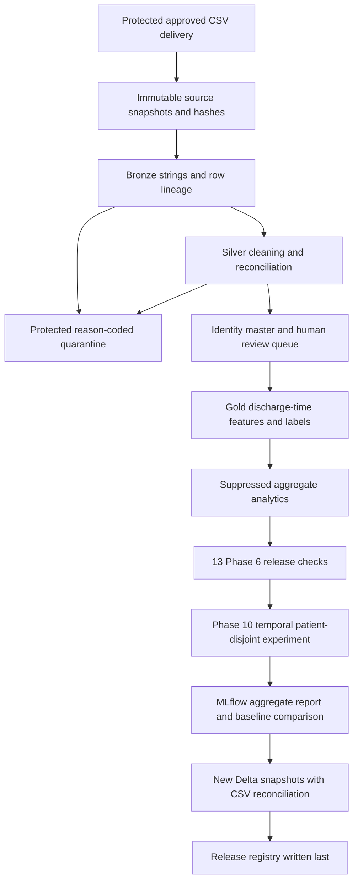

# Canonical Databricks Medallion execution

## Canonical environment and pipeline

Workspace: `https://dbc-c4f30ab9-7317.cloud.databricks.com` (workspace
`7474646231400608`). The existing Patientra Git folder is under the maintainer's
workspace home. The bundle defines an isolated `patientra_dev` catalog for
fictional smoke testing and `patientra` for approved deliveries.



`notebooks/medallion.py` runs the existing reviewed Python algorithms and then
publishes each successful run as new Delta tables. Snapshot writes use the canonical Spark `error` save mode
(fail if the table exists), avoiding the `errorifexists` alias rejected by some
Spark Connect clients. This is a bounded batch adapter,
not a distributed rewrite: input bytes total at most 50 MiB; identity, feature, and
ML processing use driver memory. Benchmark realistic deliveries before increasing
the cap or using this beyond the case study. Delta tables retain strings to preserve
the CSV contracts and blank censored labels; consumers must explicitly cast numeric
and date fields. No existing production table is overwritten or automatically
repointed to a new run.

## Input contract

The canonical raw directory must contain `patients.csv`, `admissions.csv`, and
`lab_results.csv` with the official schemas in `docs/data_dictionary.md`. LG/RS
patient IDs and source-system values are validated by the existing Silver rules.
The original files in `data/synthetic` use earlier illustrative schemas and are
not canonical production input. The separate demo generator produces fictional
contract-complete records exclusively to verify pipeline mechanics.

Default approved raw location: `/Volumes/patientra/bronze/raw`. Each execution
copies inputs, runs checks, and persists protected artifacts to
`/Volumes/<catalog>/bronze/runs/<run-uuid>/`. Hashes of all artifacts are checked
before publication. A partial or failed run has no valid release manifest; rerun
with a new UUID rather than overwriting evidence.

## Deployment and execution

Install the official Databricks CLI, authenticate using OAuth, and configure the
matching HMAC key in Databricks secret scope `patientra`, key `matching-hmac`.
Keep the key stable for an approved delivery lineage. No secret value belongs in
notebook widgets, GitHub, or job output. The demo uses an in-memory random key and
an isolated development catalog; its master tokens are not stable across runs.

From the reviewed repository checkout, supply the actual source commit and the
approved observation end before validating/deploying. The fixed ML cutoff is
2025-01-01 and is not optimized against model performance.

```powershell
$env:BUNDLE_VAR_source_commit = git rev-parse HEAD
$env:BUNDLE_VAR_observation_end = '2025-12-31'
databricks bundle validate -t dev
databricks bundle deploy -t dev
databricks bundle run -t dev medallion
```

The date above belongs to the fictional smoke data. Use the actual approved
delivery cutoff for prod. `prod` requires `main` and defaults to demo=false.
Source SHA is recorded as a deployment input; the maintainer workflow supplies
the checkout SHA. A manually supplied SHA is not an independent attestation.

The bundle runs as the maintainer user because this workspace is Free Edition.
Use a controlled service principal when the workspace supports the required
production identity and permission model. Only the maintainer receives explicit
job management permissions; inherited workspace, catalog, schema, volume, secret,
and MLflow permissions still require inspection before approved deliveries.
Do not grant contributor access to protected runtime inputs or production jobs.

The owner can also run the notebook in the Git folder by setting repository_root,
source_commit, observation_end, and catalog widgets. This is useful when the console
is used manually. The CLI and workflows avoid unsupported automated console use.

## Verification and publication

Accept a run only when:

1. The job completes successfully and its run ID is recorded.
2. Phase 6 reports 13 PASS checks and all Phase 10 technical checks pass.
3. Train/test master-patient overlap equals zero, label maturity is enforced,
   pending identities are excluded, and each split has at least 11 per outcome class.
4. Delta schemas, counts, and values equal the validated CSV artifacts.
5. `patientra.gold.release_manifests` contains the run and exact table map.
6. The maintainer reviews unresolved identity work and approves the release evidence.

The registry is a Delta table with one append per successful run. Snapshot names
include the run UUID. Consumers select the approved manifest's explicit table map;
there is deliberately no unreviewed "latest" view. Publication is not a multi-table
transaction: failures may leave unlisted snapshots, and these must not be consumed.
The job permits one concurrent run and disables automatic retries.

MLflow logs only the already reviewed aggregate report and scalar evaluation
metrics. Autologging is disabled, no trained artifact is exported, and no individual
predictions or new inference endpoint are published. Release status remains
`DEMONSTRATION_ONLY`; executing on Databricks does not establish clinical accuracy.

## GitHub releases

`Maintainer release` validates and builds a wheel from main, then creates a
prerelease and SHA-256 evidence. Only DevDataMLOps may dispatch or rerun it.
`Maintainer Databricks execution` similarly runs the test suite, validates/deploys
the bundle, and waits for the job result. Configure the environment-specific
Databricks credential separately; an ordinary contributor must not administer it.
Package release evidence explicitly does not claim verified Databricks execution.

The package version stays 0.6.1 to preserve the existing Phase 6 version contract;
tags are `v0.6.1-databricks.N`. Advance package version and validation expectations
together in a separately reviewed release. As documented in governance.md, GitHub
Write access retains native release-object management even with an owner-gated
official workflow.

## Platform status

The implementation and synthetic local tests can be validated without workspace
credentials. Successful bundle schema validation is not successful deployment.
Development execution of source commit `61e71e0374096cf47a424d55cb0a32b78e87b6ab`
was confirmed by maintainer-supplied job screenshots and final notebook output on
2026-10-02: job run `222813126927416`, pipeline run
`cee97894-2a8d-4763-b5d9-214eebb176b3`, 13 validation checks, 15 Delta snapshots,
and MLflow run `13377612f169449b85bdef25e7cf9737`. This used fictional development
data and returned `VALIDATED_DEMONSTRATION`. See `databricks-dev-evidence.json`.
The subsequent workflow and error-diagnostic corrections require a fresh workspace
run for validation of the updated source. Production permissions, approved-data
execution, and GitHub release publication remain unverified.

Publication failures report only the MLflow or Delta stage, run UUID, exception
class, and available validated Spark error-condition/SQLSTATE codes. Exception
messages, parameters, patient values, and tracebacks remain suppressed.
The earlier failed run was manually recovered; its original cause is unknown.

CI also checks the bundle against the official CLI 1.19.0 JSON schema. To run that
check locally, install `PyYAML jsonschema regex`, save `databricks bundle schema`
to a scratch JSON file, and invoke `python scripts/check_bundle.py <schema-file>`.
The check supports the CLI's Unicode patterns without relaxing schema validation.
