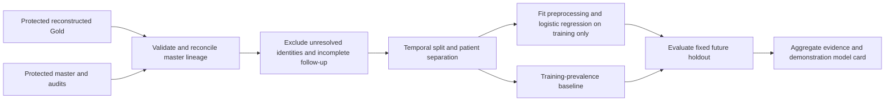

# Phase 10 — Readmission-risk demonstration

## Contract

`patientra-ml` trains a local discharge-time logistic regression and evaluates it
against a training-prevalence baseline on a fixed, future, patient-disjoint holdout.
It writes one aggregate JSON report. Models, feature matrices, master identifiers,
and admission-level probabilities remain in process memory and are not exported.
This is an experimental capability, not a clinical inference API.



## Prediction time and inputs

The target is the existing Gold `readmitted_30d` label: a subsequent admission
within 0–30 days inclusive after index discharge. Death, no-discharge and censored
rows do not become negative examples. Eligible rows still require a complete
30-day follow-up window, including observed positives, to avoid selecting only
positive outcomes near the observation end.

Eight numeric features: age, length of stay, prior completed admission count,
prior admissions within 30/365 days, prior same-diagnosis count, prior distinct
hospital count, and days since prior discharge. Four categorical features:
hospital, sex, diagnosis group and discharge status. Diagnosis/discharge fields
are assumed available at discharge in this synthetic case study; source-system
availability timestamps have not been validated.

Names, phones, birth dates, source/master/admission identifiers, outcome labels,
label status, observation end, calendar dates and laboratory summaries are absent
from the model matrix. Dates and master identifiers are used only for cohort
selection and split controls. Gold laboratory summaries are omitted because the
current generator does not enforce a lab-result availability cutoff.

The protected master file must match its SHA-256 in the Gold audit; Gold row,
status, observation-end and rule-version metadata must reconcile. Identity counts
and pending identities must reconcile with the identity audit. Entire master
identities marked `REVIEW_PENDING` are excluded from training and evaluation.
This exclusion does not resolve those identities or certify the remaining links.

## Evaluation protocol

The default cutoff is fixed at **2025-01-01**, before viewing model performance.
Training admissions must have `discharge_date + 30 days < cutoff`. Test admissions
must start on/after the cutoff and have a master identity absent from training.
Boundary admissions and returning training-patient admissions are excluded.
Consequently the result describes a future cohort of patients unseen in training,
not performance for returning patients. Multiple admissions within one holdout
patient remain correlated; confidence intervals are not estimated.

Numeric median imputation (with missingness indicators) and standardization,
plus one-hot encoding with infrequent-category grouping at 11 training rows,
are fitted inside a scikit-learn pipeline using training rows only. Unknown
holdout categories are tolerated. Logistic regression uses `C=1`, `lbfgs`,
`max_iter=2000`, seed 42, no class weighting and no hyperparameter search.
Nonconvergence fails the experiment. The baseline always uses training prevalence.
The fixed 0.5 threshold is illustrative, not selected for clinical decisions.

Report ROC AUC, average precision, Brier score, log loss and balanced accuracy.
A confusion matrix is nullified in full if any cell is below 11, including zero;
no subgroup tables, category coefficients or individual scores are exported.
Incomplete-follow-up exclusions are combined with time-boundary exclusions so
the specific small follow-up count cannot be derived from the cohort flow.

## Run locally

```powershell
python -m pip install -e ".[ml]"
patientra-ml --gold data/gold/reconstructed-phase8/readmission_features.csv --patient-master data/matching/reconstructed-phase8/patient_master.csv --identity-audit data/matching/reconstructed-phase8/identity_audit.json --gold-audit data/gold/reconstructed-phase8/readmission_feature_audit.json --cutoff 2025-01-01 --output outputs/phase10/readmission_ml.json
```

Use `python -m patientra.ml` if the console command is unavailable. Existing output
requires explicit `--overwrite`; the output cannot replace an input. Publication
uses a temporary file and atomic replacement after validation and successful
evaluation. Input hashes are checked again before publication. The CLI reports
sanitized errors without source values or file paths. Keep all protected inputs
and generated outputs Git-ignored; publish only the reviewed aggregate evidence.

The report records actual UTC execution time, hashes and dependency versions.
Scikit-learn is pinned to 1.7.2; exact transitive versions are recorded in each
execution report. Same-input reruns should reproduce rounded metrics with the
recorded environment; the execution timestamp intentionally changes.

## Interpretation and promotion gate

See the [executed model card and evidence](evidence/phase-10-ml-intelligence/README.md).
`DEMONSTRATION_ONLY` is the only release status. Technical checks verify experiment
controls, not clinical accuracy. The eight reconstructed reviews remain unresolved;
548 reconstructed readmissions are distinct from 549 in the historical reviewed
release. ML does not apply the local ABSTAIN worksheet or alter prior releases.

Before any clinical or public individual inference capability: resolve identity
governance, validate field availability and labels, obtain suitable representative
data, perform independent temporal/external validation and subgroup assessment,
estimate uncertainty, validate calibration and clinically chosen thresholds, and
design inference access/audit controls. These steps have not been completed.
The existing public dashboard/API continue serving their approved descriptive
aggregates; no ML inference endpoint or trained artifact is deployed.

## Method references

- [scikit-learn: leakage and train-only preprocessing](https://scikit-learn.org/1.7/common_pitfalls.html).
- [scikit-learn: pipelines and column transformers](https://scikit-learn.org/1.7/modules/compose.html).
- [scikit-learn: classification metrics and baseline estimators](https://scikit-learn.org/1.7/modules/model_evaluation.html).
