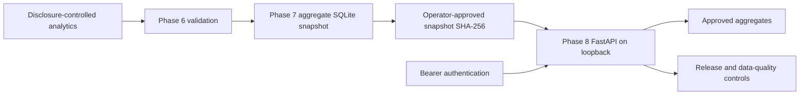

# Phase 8 — Controlled aggregate FastAPI service

## Scope and trust boundary

Phase 8 exposes a steward-approved Phase 7 SQLite snapshot through authenticated,
read-only local HTTP endpoints. It reads no raw, Bronze, Silver, Gold, identity
crosswalk, or review-queue files. It does not calculate new patient-level metrics
or provide clinical decisions. The Phase 7 publication boundary remains unchanged.



## Installation and local execution

Python 3.11+ is required. Install the API extra with `python -m pip install -e ".[api]"`.
For development and the full automated suite, install `requirements.txt`; it
includes the API extra and HTTPX test dependency. The core package continues to
have no mandatory runtime dependencies.

Publish a valid Phase 7 snapshot first, following
[the serving contract](phase7-serving.md). After the data steward has approved
that specific snapshot, configure its database path and SHA-256 locally:

```powershell
$env:PATIENTRA_API_DATABASE = "outputs/phase7/patientra_serving.sqlite"
$env:PATIENTRA_API_SNAPSHOT_SHA256 = (Get-FileHash -Algorithm SHA256 $env:PATIENTRA_API_DATABASE).Hash.ToLowerInvariant()
# Set PATIENTRA_API_TOKEN from your approved secret store in this process.
patientra-api --port 8000
```

`PATIENTRA_API_TOKEN` must contain at least 32 non-whitespace ASCII characters;
use a cryptographically random token. Never paste the token into documentation,
URLs, Git, screenshots, or logs. The server refuses missing or invalid token/hash
configuration. Hashing pins the approved bytes; it does not independently grant
data approval, authenticate the publisher, or establish clinical accuracy.

The CLI binds to `127.0.0.1` and disables request access logs. It does not provide
a public-host switch. Example authenticated client calls, using the existing
environment variable without printing it:

```powershell
$apiHeaders = @{Authorization = "Bearer $env:PATIENTRA_API_TOKEN"}
Invoke-RestMethod -Uri http://127.0.0.1:8000/api/v1/overall -Headers $apiHeaders
Invoke-RestMethod -Uri 'http://127.0.0.1:8000/api/v1/breakdowns?dimension=hospital&limit=25' -Headers $apiHeaders
Invoke-RestMethod -Uri http://127.0.0.1:8000/api/v1/pipeline-status -Headers $apiHeaders
Invoke-RestMethod -Uri http://127.0.0.1:8000/api/v1/data-quality -Headers $apiHeaders
```

Stop the server with Ctrl+C. To rotate the token or approve a replacement snapshot,
update the local environment configuration and restart. Atomic Phase 7 replacement
with different bytes returns HTTP 503 until the replacement digest is approved
and configured; the API never silently trusts the new file.

## Endpoint contract

All implemented endpoints require `Authorization: Bearer <token>`. There are no
write, arbitrary SQL, database-path, patient, category-filter, or joined-filter
endpoints. Interactive Swagger is available at `/docs`, with its public API contract
at `/openapi.json`. Click **Authorize**, enter the existing bearer token without
the `Bearer` prefix, then use **Try it out** and **Execute**. Documentation contains
schemas rather than release data; every data endpoint remains authenticated.
Authorization is not persisted across reloads and external schema validation is
disabled. ReDoc remains disabled. CORS is
not enabled. Responses use `Cache-Control: no-store` and `X-Content-Type-Options: nosniff`.

| GET endpoint | Response |
|---|---|
| `/health` | Authenticated process liveness only; independent of snapshot availability. |
| `/ready` | Readiness after snapshot integrity, release, and disclosure checks. |
| `/api/v1/overall` | Six approved cohort counts, rate, and confidence-interval fields. |
| `/api/v1/breakdowns` | Unsuppressed aggregates in a deterministic page: `items`, `total`, `limit`, `offset`. Suppressed rows and their categories are omitted. |
| `/api/v1/pipeline-status` | Release status, passing check count, publication/source-run times, artifact hashes, and publication/current freshness. |
| `/api/v1/data-quality` | Gold/eligible/excluded row counts, breakdown/released/suppressed counts, minimum cell size, passing check count, reconciliation and suppression checks. |

Breakdowns support only an optional single `dimension`, `limit` (1–100, default
100), and `offset` (0–10,000, default 0). Allowed dimensions are `hospital`, `sex`,
`age_band`, `diagnosis_group`, `discharge_status`,
`prior_completed_admission_band`, `length_of_stay_band`, `discharge_year`, and
`discharge_month`. Unknown or repeated query parameters and invalid bounds return
422 without echoing supplied values. Other endpoints accept no query parameters.

Authentication failures return 401. Missing, changed, corrupt, malformed, or
unreleased snapshots return a generic 503 without paths, SQL, underlying records,
or diagnostic exceptions. Unsupported methods return 405. Invalid configuration
prevents server startup.

## Snapshot and disclosure checks

Each data request reads at most 64 MiB and hashes those exact bytes against the
configured digest. The same bytes are deserialized into a private in-memory SQLite
connection with `query_only` and `trusted_schema=OFF`. This avoids replacement
races between hashing and reading; the original file is never opened for writing.

Only the fixed Phase 7 table schemas are accepted. Queries select explicit columns
with fixed SQL. The API verifies one overall row and one status row, `PASS`, 13
passing checks, hash formats, nonnegative count types, Gold cohort reconciliation,
analytics count/rate consistency, interval bounds, and publication metadata.
It checks the configured disclosure minimum (at least 11), breakdown dimensions,
suppression reasons, NULL protected metrics, and breakdown counts. It never
trusts a database view to determine which rows may be released. At most 10,000
breakdown rows are accepted; HTTP responses contain at most 100.

The API checks the approved snapshot, rather than rerunning the Phase 6 pipeline
against protected files. The stored source artifact hashes are lineage metadata;
they are not live rehashes of upstream files. Steward approval of the pinned
snapshot remains essential.

## Freshness and governance limitations

`freshness_at_publication` preserves Phase 7's label. `current_freshness` and
`current_source_age_seconds` are recomputed per request against the analytics-run
timestamp with the same 24-hour threshold. A valid stale snapshot remains queryable
with an explicit `STALE` status; readiness means technically serveable, not fresh.
Neither freshness field measures the age of the hospital records.

Data-quality responses report `identity_resolution: not_assessed` and
`clinical_accuracy: not_assessed` when identity evidence is absent. Hosted release
bundles can include checked review counts and report `reviews_unresolved` or
`reviews_completed`; clinical accuracy remains unassessed. The SQLite contract contains no identity-review
completion evidence; Phase 8 does not infer it from `PASS`. Source completeness,
Silver quarantine rates, fairness, and clinical accuracy are not measured by
these endpoints. The reconstructed Phase 7 run's eight unresolved identity-review
cases remain a governance limitation, documented in its
[evidence summary](evidence/phase-7-serving-observability/README.md).

The local CLI binds to loopback. The separate hosted entry point is now deployed
on Render with managed HTTPS, bearer authentication, exact hostname checks, and
60 authenticated requests per minute per process. A shared credential does not
provide per-user roles or scopes. This is not a production clinical API. No
patient-level values, SQLite database, token, or protected review artifacts are
uploaded to GitHub.

The [public deployment contract](phase8-cloud-deployment.md) transfers a typed
unsuppressed JSON bundle through a private provider secret file and keeps SQLite
local. Optional non-root container and Cloud Run tooling remains available but
was not used for this native Python deployment. Public HTTPS readiness
and authenticated aggregate responses are verified against the approved local
release; unauthenticated requests return 401.

See [Phase 8 execution evidence](evidence/phase-8-fastapi/README.md) for the actual
historical-release smoke test and its distinction from the reconstructed run.

Implementation references: [FastAPI security tools](https://fastapi.tiangolo.com/reference/security/),
[FastAPI testing](https://fastapi.tiangolo.com/tutorial/testing/), and
[Uvicorn settings](https://www.uvicorn.org/settings/).
