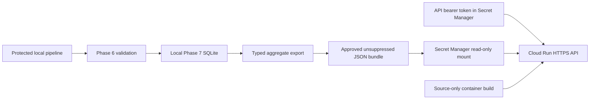

# Phase 8 — Aggregate-only Cloud Run deployment

## Current execution boundary

The reconstructed cohort is independently rebuilt and locally verified: 548
readmissions among 2,827 eligible admissions (19.38%), 2,000 master patients, and
**eight unresolved identity reviews**. Phase 6 returned 13 passing checks and
Phase 7 published a fresh local snapshot. Historical review decisions and results
were preserved; no human decisions were invented.

Hosted application mode passed a real local HTTP smoke test using an approved
aggregate JSON bundle. **Public deployment is pending billing enablement** in the
selected Google Cloud project. The deployment preflight stopped before changing
cloud resources because billing was disabled. No public URL, cloud build, hosted
container, or remote HTTPS verification is claimed as completed.

## Architecture and transfer boundary



SQLite stays local. The exported bundle contains only typed overall metrics,
unsuppressed breakdowns, pipeline status, and data-quality/governance counts.
Suppressed rows and category labels are omitted. Identity counts require local
identity → patient-master → Gold → release-validation lineage checks. No
patient-level data, identity crosswalk, review queue, or matching secret is
transferred to the provider.

The source-upload inventory contains only Python source, package metadata, README,
Dockerfile, and ignore controls. `.gcloudignore` and `.dockerignore` exclude
operational artifacts. The container runs as UID 10001 and uses a separate hosted
entry point. The local CLI remains loopback-only.

## Export and deploy

Install `python -m pip install -e ".[api]"`. After local reconstruction and release
validation, export the approved release:

```powershell
patientra-export-release --database outputs/reconstructed-phase8/phase7/patientra_serving.sqlite --output outputs/reconstructed-phase8/approved-release.json --identity-audit data/matching/reconstructed-phase8/identity_audit.json --patient-master data/matching/reconstructed-phase8/patient_master.csv --gold-audit data/gold/reconstructed-phase8/readmission_feature_audit.json --gold data/gold/reconstructed-phase8/readmission_features.csv --validation outputs/reconstructed-phase8/phase6/release_validation.json
```

Export refuses an existing output path, incomplete lineage, invalid counts, and
failed disclosure checks. Each approved release uses a new output path. All
operational inputs and the JSON bundle remain Git-ignored.

After billing is enabled, an authorized deployer can run:

```powershell
.\scripts\deploy_cloud_run.ps1 -Project YOUR_PROJECT_ID -ApprovedBundle outputs/reconstructed-phase8/approved-release.json -PythonCommand .\.venv\Scripts\python.exe
```

The first-deployment helper validates the bundle, 64 KiB secret size limit, billing
state, and upload inventory. It enables required APIs, creates separate runtime and
build accounts, grants the documented Cloud Run builder role, and creates versioned
Secret Manager resources for the bundle and a new random API token. Runtime access
is granted only on those secrets. Existing services and secrets are not overwritten.

Deployment uses `us-east1`, zero minimum and one maximum instance, concurrency 10,
512 MiB memory, a 30-second timeout, and managed HTTPS ingress. Platform ingress is
public; application bearer authentication remains required. The helper verifies
readiness, aggregate/quality/status responses, and unauthenticated HTTP 401 over the
returned URL before reporting success. The temporary token file is removed in a
`finally` block; secret values are not printed or placed in command arguments.

Billing is not linked automatically. Deployers need the documented provider API,
IAM, source-deployment, and Secret Manager permissions. Failures after resource
creation require review of the actual provider state. Subsequent revisions require
an explicitly reviewed update with new secret versions; do not rerun blindly over
an existing deployment.

## Hosted controls and limits

`patientra-api-cloud` requires `PATIENTRA_API_RELEASE_BUNDLE`, its
`PATIENTRA_API_BUNDLE_SHA256`, and `PATIENTRA_API_TOKEN`, and honors provider `PORT`.
It retains fixed query surfaces, response models, disclosure checks and dynamic
freshness. It rejects untrusted hosts, disables app access logs/proxy-header trust,
and limits authenticated traffic to 60 requests per minute per process. Excess
traffic returns 429 with `Retry-After: 60`. This is not a distributed/per-user quota.

Authorized callers obtain the token through their approved Secret Manager workflow
and send it only in the Authorization header. Never place secrets or identifiers
in URLs: provider request logs can retain query metadata even when application
access logs are disabled. Audit logging and retention belong to the hosting project.

Without identity evidence, quality remains `not_assessed`. A locally checked bundle
can report `reviews_unresolved` or `reviews_completed`; this release reports eight
unresolved reviews and 2,000 master patients. Completed reviews do not establish
clinical accuracy, which remains `not_assessed`. `PASS` and `FRESH` retain their
technical/analytics-recency meanings. This is not a production clinical API.

Provider references: [source deployment](https://docs.cloud.google.com/run/docs/deploying-source-code),
[Secret Manager](https://docs.cloud.google.com/secret-manager/docs/creating-and-accessing-secrets),
[HTTPS endpoints](https://docs.cloud.google.com/run/docs/triggering/https-request),
and [pricing](https://cloud.google.com/run/pricing). Runtime, build, secret and image
storage charges can apply; maximum instances are not a billing spend cap.
