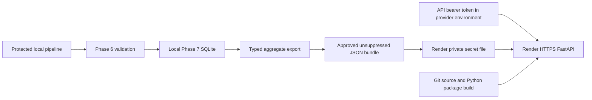

# Phase 8 — Aggregate-only public deployment

## Current execution boundary

The reconstructed cohort is independently rebuilt and locally verified: 548
readmissions among 2,827 eligible admissions (19.38%), 2,000 master patients, and
**eight unresolved identity reviews**. Phase 6 returned 13 passing checks and
Phase 7 published a fresh local snapshot. Historical review decisions and results
were preserved; no human decisions were invented.

Hosted application mode passed a real local HTTP smoke test using an approved
aggregate JSON bundle. The service is now deployed on Render's free Python web
service at https://patientra-api.onrender.com. Render reports the deployed code
revision `c019980533f3f6f7b026b214cc915ad36e0f4963` as live. Public HTTPS without
credentials returned 401; authenticated readiness and all aggregate endpoints
returned 200 and matched the approved local release.
The earlier Google Cloud preflight stopped before changing resources because
billing was disabled; the user selected a different provider.

## Architecture and transfer boundary



SQLite stays local. The exported bundle contains only typed overall metrics,
unsuppressed breakdowns, pipeline status, and data-quality/governance counts.
Suppressed rows and category labels are omitted. Identity counts require local
identity → patient-master → Gold → release-validation lineage checks. No
protected local patient-level data, identity crosswalk, review queue, or matching
secret is transferred to the provider. Render clones the already-public Git
repository, which includes synthetic starter data and test fixtures; those
folders and Git history are removed from the deployed runtime during the build.
They are not used by the API. No new patient-level files are committed or uploaded.

Render builds the Git-tracked repository, installs `.[api]`, and runs
`patientra-api-cloud` on the provider's `PORT`. Operational artifacts are ignored
and absent from Git. The native Python deployment does not use the Dockerfile.
The local CLI remains loopback-only. Optional Cloud Run/container tooling remains
available separately; its cloud deployment and container execution are unverified.

## Export and deploy

Install `python -m pip install -e ".[api]"`. After local reconstruction and release
validation, export the approved release:

```powershell
patientra-export-release --database outputs/reconstructed-phase8/phase7/patientra_serving.sqlite --output outputs/reconstructed-phase8/approved-release.json --identity-audit data/matching/reconstructed-phase8/identity_audit.json --patient-master data/matching/reconstructed-phase8/patient_master.csv --gold-audit data/gold/reconstructed-phase8/readmission_feature_audit.json --gold data/gold/reconstructed-phase8/readmission_features.csv --validation outputs/reconstructed-phase8/phase6/release_validation.json
```

Export refuses an existing output path, incomplete lineage, invalid counts, and
failed disclosure checks. Each approved release uses a new output path. All
operational inputs and the JSON bundle remain Git-ignored.

### Active Render service

- Runtime: Python 3.12.11; free 512 MB instance in Oregon.
- Source branch: `feat/phase-8-public-deployment`; automatic deployment disabled.
- Build: install `.[api]`, then remove `data`, `tests`, and `.git` from the
  provider's temporary runtime checkout; start: `patientra-api-cloud`. The pruning
  command refuses execution outside a Render project build directory.
- Private secret file: `approved-release.json`, mounted at
  `/etc/secrets/approved-release.json`.
- Environment: `PATIENTRA_API_RELEASE_BUNDLE` points to that mount;
  `PATIENTRA_API_BUNDLE_SHA256` pins the exact UTF-8 bytes;
  `PATIENTRA_API_TOKEN` is a provider-generated bearer secret. Do not commit or
  display it. `PYTHON_VERSION` selects 3.12.11.
- Host validation uses the exact provider `RENDER_EXTERNAL_HOSTNAME`, rejecting
  other Render service names. TCP health checks preserve authenticated HTTP routes.
- Managed HTTPS terminates at Render; no protected local patient data or SQLite is uploaded.

Render's secret-file editor removes the final newline. During this deployment,
the local export was 14,065 bytes with SHA-256
`af0ac48a807f3dc105e67ac17b0a06e5dd3f963d3186d8f8d659d062a03e05c3`.
The provider editor and runtime startup diagnostic independently confirmed the
mounted file as the same JSON without that final
newline: 14,064 bytes, SHA-256
`db0e254bcac4a12f62f60823a9cf08768d99eef77e253b751170e640394cca11`.
The latter digest is pinned in the Render environment. The original local export
is preserved. Before uploading through this editor, prepare and validate a copy
without the final newline, then use its exact digest:

```python
from pathlib import Path
import hashlib
from patientra.api.bundle import read_bundle
source = Path("outputs/reconstructed-phase8/approved-release.json")
target = source.with_name("approved-release-render.json")
content = source.read_bytes().rstrip(b"\n")
with target.open("xb") as output:  # Never overwrite a prior approved release.
    output.write(content)
digest = hashlib.sha256(content).hexdigest()
read_bundle(target, digest)  # Must pass before provider transfer.
print(digest)  # Safe artifact metadata, never the bearer token.
```

To update, export and locally verify a new aggregate release, update its private
secret file and digest together, deploy a reviewed Git revision manually, and
check authenticated readiness plus all aggregate endpoints. Missing or modified
bundle bytes fail closed with 503. A TCP health check proves process connectivity;
only authenticated `/ready` checks the approved release.

The free service sleeps after inactivity and can take 50 seconds or more to wake.
It has no production availability commitment or persistent disk. This is a
controlled demonstration API, not a production clinical service.

### Optional Cloud Run deployment (not executed)

After billing is enabled, an authorized deployer can run:

```powershell
.\scripts\deploy_cloud_run.ps1 -Project YOUR_PROJECT_ID -ApprovedBundle outputs/reconstructed-phase8/approved-release.json -PythonCommand .\.venv\Scripts\python.exe
```

The first-deployment helper validates the bundle, 64 KiB secret size limit, billing
state, and upload inventory. It enables required APIs, creates separate runtime and
build accounts, grants the documented Cloud Run builder role, and creates versioned
Secret Manager resources for the bundle and a new random API token. Runtime access
is granted only on those secrets. Existing services and secrets are not overwritten.

Deployment uses `us-east1`, zero minimum and one maximum instance, concurrency 10,
512 MiB memory, a 30-second timeout, and managed HTTPS ingress. Platform ingress is
public; application bearer authentication remains required. The helper verifies
readiness, aggregate/quality/status responses, and unauthenticated HTTP 401 over the
returned URL before reporting success. The temporary token file is removed in a
`finally` block; secret values are not printed or placed in command arguments.

Billing is not linked automatically. Deployers need the documented provider API,
IAM, source-deployment, and Secret Manager permissions. Failures after resource
creation require review of the actual provider state. Subsequent revisions require
an explicitly reviewed update with new secret versions; do not rerun blindly over
an existing deployment.

## Hosted controls and limits

`patientra-api-cloud` requires `PATIENTRA_API_RELEASE_BUNDLE`, its
`PATIENTRA_API_BUNDLE_SHA256`, and `PATIENTRA_API_TOKEN`, and honors provider `PORT`.
It retains fixed query surfaces, response models, disclosure checks and dynamic
freshness. It rejects untrusted hosts, disables app access logs/proxy-header trust,
and limits authenticated traffic to 60 requests per minute per process. Excess
traffic returns 429 with `Retry-After: 60`. This is not a distributed/per-user quota.

Authorized callers obtain the token through their approved provider-secret workflow
and send it only in the Authorization header. Never place secrets or identifiers
in URLs: provider request logs can retain query metadata even when application
access logs are disabled. Audit logging and retention belong to the hosting account.

Without identity evidence, quality remains `not_assessed`. A locally checked bundle
can report `reviews_unresolved` or `reviews_completed`; this release reports eight
unresolved reviews and 2,000 master patients. Completed reviews do not establish
clinical accuracy, which remains `not_assessed`. `PASS` and `FRESH` retain their
technical/analytics-recency meanings. This is not a production clinical API.

Provider references: [source deployment](https://docs.cloud.google.com/run/docs/deploying-source-code),
[Secret Manager](https://docs.cloud.google.com/secret-manager/docs/creating-and-accessing-secrets),
[HTTPS endpoints](https://docs.cloud.google.com/run/docs/triggering/https-request),
and [pricing](https://cloud.google.com/run/pricing). Runtime, build, secret and image
storage charges can apply; maximum instances are not a billing spend cap.

Render references: [web services](https://render.com/docs/web-services),
[environment variables and secret files](https://render.com/docs/configure-environment-variables),
[free service limits](https://render.com/docs/free), and
[TCP health checks](https://render.com/docs/health-checks).

### Public verification

Authenticated `/health`, `/ready`, and all four `/api/v1` aggregate endpoints
returned 200. The complete overall response, 43 released breakdown rows,
pipeline release metadata/hashes, and data-quality counts matched the approved
local bundle. All six routes returned 401 without authentication; an invalid
token also returned 401. Invalid queries returned 422, POST returned 405, and
`/docs` and `/openapi.json` returned 404. Cache-Control was `no-store` and
X-Content-Type-Options was `nosniff`. These checks do not establish clinical
accuracy, production availability, or complete identity resolution.

The safe [HTTP verification record](evidence/phase-8-fastapi/public-http-verification.json)
contains the actual verification time, deployed code revision, aggregate results,
and status codes. No token, protected category, identifier, or database is included.
