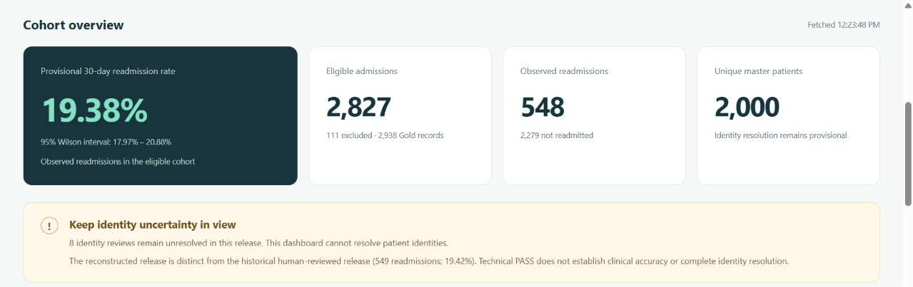
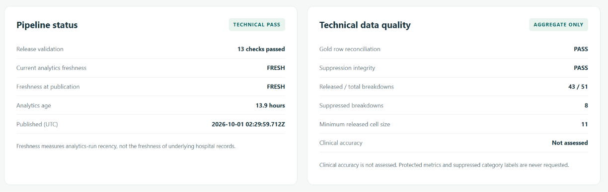
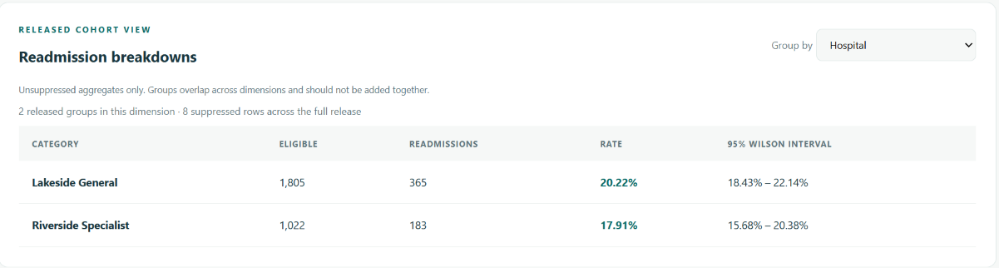
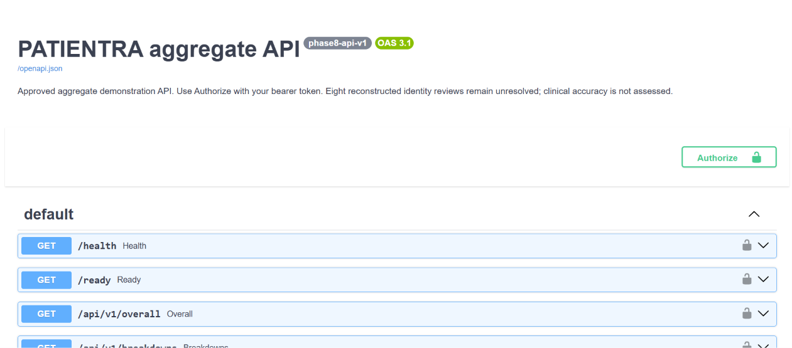
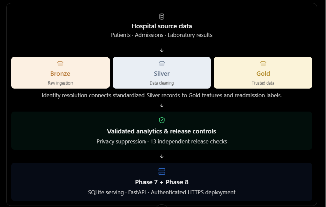

# PATIENTRA — Aggregate API and dashboard showcase

From governed hospital data to an authenticated aggregate view: PATIENTRA connects
its validated pipeline, SQLite serving, FastAPI, and responsive dashboard without
publishing patient-level records.

[Open the live dashboard](https://patientra-api.onrender.com/dashboard) ·
[Explore Swagger](https://patientra-api.onrender.com/docs) ·
[Phase 9 execution evidence](../evidence/phase-9-dashboard/README.md)

The dashboard and Swagger shell are public. Approved data endpoints require the
existing API bearer token; obtain it through the authorized Render environment
workflow. Never put a token in GitHub, screenshots, chat, or a URL. The free Render
instance may take a minute to wake after inactivity.

## Cohort overview and identity governance

The reconstructed release shows **548 observed 30-day readmissions**, a **19.38%**
provisional rate, **2,827 eligible admissions**, and **2,000 unique master patients**.
There are 111 excluded admissions from 2,938 Gold records. The displayed 95% Wilson
interval is 17.97%–20.88%.

**Eight patient identity-review cases remain unresolved.** This reconstruction is
distinct from the historical human-reviewed release: 549 readmissions and 19.42%.
The demo review worksheet records eight `ABSTAIN` decisions and has not been applied
to the public release. These screenshots do not establish clinical accuracy.

## Pipeline status and technical data quality

The captured view records 13 validation checks passed, row reconciliation and
suppression integrity `PASS`, and **43 released rows out of 51 breakdowns**.
Eight rows are suppressed; the minimum released cell size is 11.

`FRESH` describes analytics-run recency **at capture**, not current freshness or
the age of underlying hospital records. The displayed publication time is release
metadata, not an inferred screenshot timestamp. Technical `PASS` does not mean
clinical accuracy or complete identity resolution; clinical accuracy is not assessed.

## Released hospital breakdowns

| Released hospital | Eligible | Readmissions | Provisional rate |
|---|---:|---:|---:|
| Lakeside General | 1,805 | 365 | 20.22% |
| Riverside Specialist | 1,022 | 183 | 17.91% |

Only unsuppressed aggregates are displayed. The dashboard supports nine dimensions;
groups across different dimensions overlap and should not be added together.
These rates are descriptive case-study outputs, not a clinical ranking or risk model.

## Interactive FastAPI contract

Swagger exposes the API contract and an **Authorize** button. Health, readiness,
overall, breakdowns, pipeline status, and data quality remain bearer-protected.
The screenshot shows no credential or patient-level response. Authorizing does
not resolve patient identities or establish clinical validity.

## Architecture overview

This supplied architecture graphic is explanatory, rather than a runtime execution
trace. The complete implemented flow is:

Bronze → Silver → Identity Resolution → Gold → Analytics → Phase 6 Validation →
Phase 7 SQLite → Phase 8 FastAPI → Phase 9 Dashboard.

Hosted mode uses a private, typed aggregate export; SQLite and protected operational
files remain local. See the [dashboard contract](../phase9-dashboard.md) for the
authentication, consistency, suppression, and browser security controls.

## Provenance and limits

These are original user-supplied screenshots, copied without visual alteration.
Two supplied Swagger captures show the same interface; one is included to avoid
duplication. The architecture graphic is labeled as illustrative. No capture
timestamp, checksum, or test result is inferred from image filenames.

Phase 9's recorded execution passed 105 local automated tests, all four CI jobs,
and public HTTPS/browser checks; the [verification record](../evidence/phase-9-dashboard/public-verification.json)
provides the actual verified revision and time. This image-only documentation
follow-up does not rerun or change the release. The service remains a controlled
demonstration. Production availability/load, per-user authorization, broader
browser coverage, and clinical validation are not established.
